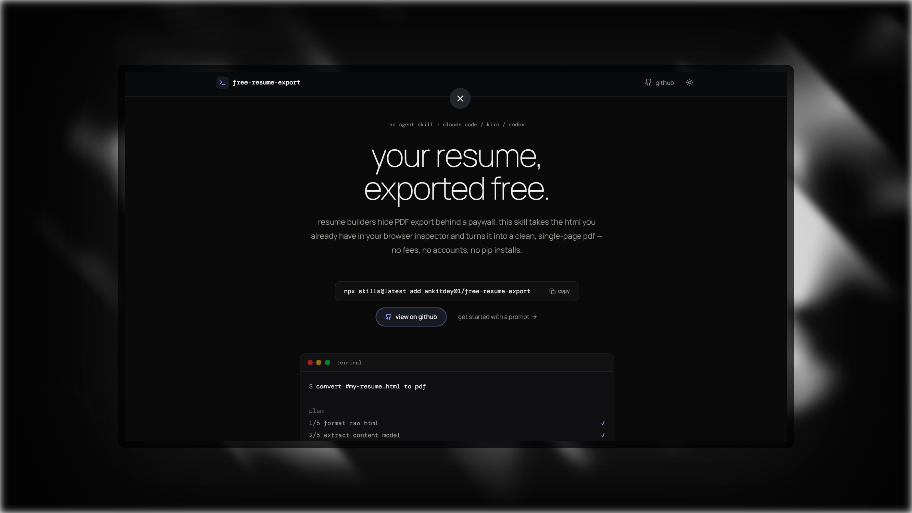

# free-resume-export-site

Landing page for the [free-resume-export](https://github.com/ankitdey01/free-resume-export) agent skill, a CLI-styled site that pitches stripping the resume-builder export paywall.



## Stack

- [Next.js](https://nextjs.org) (App Router, static output)
- [Tailwind CSS](https://tailwindcss.com) v4 (CSS-first tokens, light/dark themes)
- [Manrope](https://fonts.google.com/specimen/Manrope) + [DM Mono](https://fonts.google.com/specimen/DM+Mono), self-hosted via `next/font`

## Run

```bash
npm install
npm run dev
```

Open http://localhost:3000.

## Scripts

| command              | what it does            |
| -------------------- | ----------------------- |
| `npm run dev`        | start dev server        |
| `npm run build`      | production build        |
| `npm run start`      | serve production build  |
| `npm run typecheck`  | run `tsc --noEmit`      |
